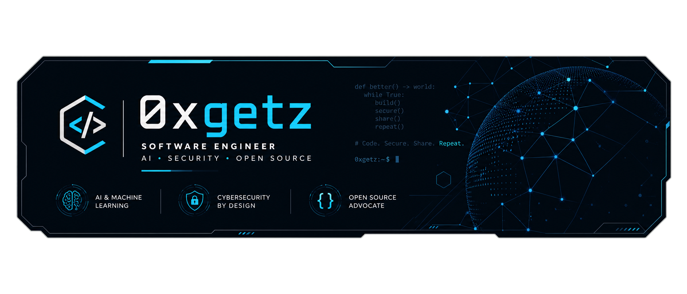

<div align="center">



<p>&nbsp;</p>


</div>

<div align="center">

[](https://github.com/0xgetz)
[](https://github.com/0xgetz)

</div>

<br/>

```
+----------------------------------------------------------------------+
|  > whoami                                                            |
|  0xgetz -- Software Engineer & Security Researcher                   |
|  Focus:     AI agents · dev tooling · security · privacy · Web3      |
|  Languages: Python · TypeScript · Rust · Kotlin · Solidity           |
|  Ethos:     Open source. Self-hostable. Bring your own key.          |
+----------------------------------------------------------------------+
```

<br/>

---

## `> cat /proc/stack`

<div align="center">

### Languages & Core Runtimes


### AI & Autonomous Agents


### Web, Mobile & Infrastructure


### Security & Cryptography


</div>

---

## `> git log --stat`

<div align="center">


</div>

---

## `> ls -la ~/projects`

<div align="center">

<table>
<tr>
<td width="50%">

### 📱 [AeroVPN](https://github.com/0xgetz/AeroVPN)

```
Production Android VPN client with multi-protocol
support (SSH, V2Ray/Xray, WireGuard). Privacy first,
no ads, APK < 15MB.
```


</td>
<td width="50%">

### 🧠 [nexusforge](https://github.com/0xgetz/nexusforge)

```
Open-source AI development platform: coding assistant,
security scanner, and self-healing engine. Free,
private, multi-model.
```


</td>
</tr>
<tr>
<td width="50%">

### 🛡️ [allowScanner](https://github.com/0xgetz/allowScanner)

```
Async web security scanner — 17 recon & security
modules, single 0-100 score. CI-ready, Docker support.
```


</td>
<td width="50%">

### 📈 [daily_forex_analysis](https://github.com/0xgetz/daily_forex_analysis)

```
LLM-assisted technical analysis for FX & metals.
Multi-timeframe indicators, 24/5 sessions, BYO keys.
```


</td>
</tr>
<tr>
<td width="50%">

### ⚡ [GitVibe](https://github.com/0xgetz/GitVibe)

```
Turn any Git repo into an optimal AI coding prompt.
Self-hostable · zero tracking · Ollama-friendly.
```


[](https://gitvibe.space-z.ai/)

</td>
<td width="50%">

### 📚 [awesome-token-saving](https://github.com/0xgetz/awesome-token-saving)

```
3,300 practical techniques to cut LLM token usage by
up to 90% — 300 core principles + 3,000 applications.
```


</td>
</tr>
<tr>
<td width="50%">

### 🦀 [grok-kit](https://github.com/0xgetz/grok-kit)

```
Rust starter kit for building with grok-build crates:
config, doctor, headless agent.
```


</td>
<td width="50%">

### 📊 [polymarket-btc-5m](https://github.com/0xgetz/polymarket-btc-5m)

```
BTC 5-minute Up/Down momentum trading skill for
Polymarket — sizing controls, optional micro-hedge.
```


</td>
</tr>
</table>

</div>

<details>
<summary><b>&nbsp;&gt; ls ~/projects --all</b></summary>

<br/>

| Project | Stack | What it is |
|---|---|---|
| [VortexOSINT](https://github.com/0xgetz/VortexOSINT) | Python | OSINT toolkit — username, email, domain, IP & phone recon from free public sources |
| [Daytona-Terminal-VNC](https://github.com/0xgetz/Daytona-Terminal-VNC) | Python | Sandbox launcher: browser-based terminal + VNC desktop with an AI agent inside |
| [grok-chat-bridge](https://github.com/0xgetz/grok-chat-bridge) | Python | Stdlib-only bridge connecting Telegram/Discord/WhatsApp bots to Grok over ACP |
| [premium-telegram-bot](https://github.com/0xgetz/premium-telegram-bot) | TypeScript | Production Telegram bot with free tier + paid features (Telegram Stars, Stripe) |
| [resume-forge](https://github.com/0xgetz/resume-forge) | JavaScript | AI resume & cover letter builder that runs 100% in the browser |
| [ai-scam-shield](https://github.com/0xgetz/ai-scam-shield) | Python | Detects fake "free AI credit" phishing sites and checks email breach exposure |
| [ai-proxy-hub](https://github.com/0xgetz/ai-proxy-hub) | Python | AI proxy hub for routing and managing multiple LLM providers |
| [xi-agent-skills](https://github.com/0xgetz/xi-agent-skills) | Python | Agent skills and tooling for the xi AI ecosystem |
| [c-code](https://github.com/0xgetz/c-code) | TypeScript | C code generation and analysis tooling |
| [octra-ai-agent](https://github.com/0xgetz/octra-ai-agent) | JavaScript | AI agent for the Octra ecosystem |
| [nebula-code](https://github.com/0xgetz/nebula-code) | Rust | AI coding agent with federated learning and multi-agent orchestration |
| [zk-fuzzer-ultra](https://github.com/0xgetz/zk-fuzzer-ultra) | Rust | ZK circuit fuzzer with LLM-guided mutation and TCCT-based bug detection |
| [octrashield-dex](https://github.com/0xgetz/octrashield-dex) | TypeScript | Privacy DEX concept: encrypted AMM via homomorphic encryption, MEV protection |
| [taceo-private-voting](https://github.com/0xgetz/taceo-private-voting) | TypeScript | Private voting dApp — Groth16 verification, Merkle eligibility, MPC |
| [bug-bounty-mec](https://github.com/0xgetz/bug-bounty-mec) | Python | Bug bounty research write-up: 10 original vulnerabilities in ME Hub Phase I |
| [jailbreak-AI](https://github.com/0xgetz/jailbreak-AI) | — | AI safety and jailbreak research |
| [Tgviews](https://github.com/0xgetz/Tgviews) | Python | Telegram views and engagement tooling |
| [o](https://github.com/0xgetz/o) | Python | Utility and experimental scripts |

</details>

---

## `> echo "open to collab"`

<div align="center">

*I build tooling at the intersection of AI agents, security, and privacy —*
*open source by default, self-hostable, and runnable with your own API keys.*

<br/>

[](https://github.com/0xgetz)

</div>


