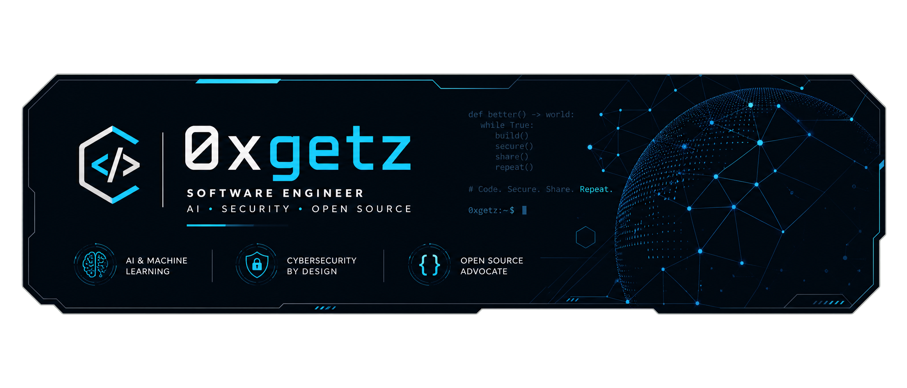

<div align="center">



<p>&nbsp;</p>


</div>

<div align="center">

[](https://github.com/0xgetz)
[](https://t.me/xiyyyyz)
[](https://t.me/inspectoraiofc)
[](https://github.com/0xgetz)

</div>

<br/>

```
+----------------------------------------------------------------------+
|  > whoami                                                            |
|  0xgetz -- Software Engineer & Security Researcher                   |
|  Focus:     AI agents · dev tooling · security · privacy · Web3      |
|  Languages: Python · TypeScript · Rust · Kotlin · Solidity           |
|  Ethos:     Open source. Self-hostable. Bring your own key.          |
+----------------------------------------------------------------------+
```

<br/>

---

## `> cat /proc/stack`

<div align="center">

### Languages & Core Runtimes


### AI & Autonomous Agents


### Web, Mobile & Infrastructure


### Security & Cryptography


</div>

---

## `> git log --stat`

<div align="center">


</div>

---

## `> echo "open to collab"`

<div align="center">

*I build tooling at the intersection of AI agents, security, and privacy —*
*open source by default, self-hostable, and runnable with your own API keys.*

<br/>

[](https://github.com/0xgetz)
[](https://t.me/xiyyyyz)
[](https://t.me/inspectoraiofc)

</div>


